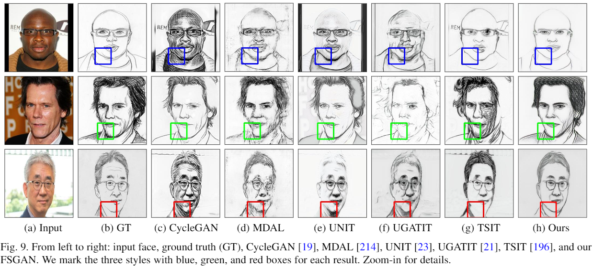

# FS2K dataset

> Towards the translation between Face <--> Sketch.
>
> **Download** (photo+sketch+annotation): [Google-drive](https://drive.google.com/file/d/1saIMhQ3dc5_ftkfGmBPbCluRn_zy7QQp/view?usp=sharing), [Baidu-disk, pw: FS2K](https://pan.baidu.com/s/1eJVNPlGRbCc2zSp4iO8bVw).

### Updates:

+ 2021-09-20: Add [a script](https://github.com/DengPingFan/FS2K/blob/main/tools/split_train_test.py) for splitting the FS2K dataset into train & test.
+ 2021-08-31: [FS2K Dataset](https://github.com/DengPingFan/FS2K) is released!

### Introduction:

We elaborately build a new high-quality **Facial Sketch Synthesis** (FSS) dataset, termed **FS2K**. It is the largest publicly released FSS dataset, consisting of 2,104 (1,058+1,046) **image-sketch pairs** from a wide range of image backgrounds, skin colors, sketch styles, and lighting conditions. In addition, we also provide extra **attributes**, e.g., gender, smile, hair condition, etc., to enable deep learning models to learn more detailed cues. Finally, the sketches from FS2K are **drawn by professional artists** assisted by the guidelines and copy lights, which differs from all previous dataset. Thus, FS2K not only embedded the sketch style from artists but also the facial content from the photo.

Establishing the FSS dataset drawn by professional artists is more challenge than other face datasets, that is why the existing largest FSS dataset in the past 13 years has only ∼1K images. Although the image scale is only ∼2 times larger than CUFSF, we still spent 1 year to create such a high-quality dataset.

The structure of dataset you download should look as follows:

```
FS2K
├── photo
│       ├── photo1		(1,529, source: CASIA-WebFace)
│       ├── photo2		(98,    source: invited eight actors)
│       └── photo3		(477,   source: free stock photos websites, including Unsplash, Pexels, Pngimg and Google)
├── sketch
│       ├── sketch1
│       ├── sketch2
│       └── sketch3
├── anno_test.json
├── anno_train.json
└── README.pdf
```

#### 	How we made it:


## Diversity

> In order to make the dataset more comprehensive, we tried to keep a high level of diversity in our dataset.

### 	Photos

​		*We collected the photos of various conditions, including lighting, background and age.*


### 	Sketches

​		*In order to make the sketches have a style diversity, we asked the professional artists to draw these sketches in three different styles.*


## Attributes

> We collected several key attributes such as the hair color, smiling and gender as the annotations. These attributes could help further researches like conditional generation, .


#### Annotations

```python
[{
	"image_name": "photo1/image0110",

	"skin_patch": [163, 139],
	# a point of face region.

	"lip_color": [156.97750511247443, 82.51124744376278, 79.0],
	# the mean RGB value of lip area.

	"eye_color": [118.65178571428571, 72.25892857142857, 69.59821428571429],
	# the mean RGB value of eye area.

	"hair": 0,
	# 0: with hair, 1: without hair.

	"hair_color": 2,
	# 0: brown, 1: black, 2: red, 3: no-hair, 4: golden.

	"gender": 0,
	# 0: male, 1: female.

	"earring": 1,
	# 0: with earring, 1: without earring.

	"smile": 1,
	# 0: with smile, 1: without smile.

	"frontal_face": 1,
	# 0: head rotates within 30 degrees, 1: > 30 degrees

	"style": 0
	# Style = one of {0, 1, 2}, please refer to the sketch samples.
},
...
]
```

#### Attributes Count

|   FS2K    | w/ H | w/o H | H(b) | H(bl) | H(r) | H(g) |  M   |  F   | w/ E | w/o E | w/ S | w/o S | w/ F | w/o F |  S1  |  S2  |  S3  |
| :-------: | :--: | :---: | :--: | :---: | :--: | :--: | :--: | :--: | :--: | :---: | :--: | :---: | :--: | :---: | :--: | :--: | :--: |
| **Train** | 1010 |  48   | 288  |  423  |  60  | 239  | 574  | 484  | 209  |  849  | 645  |  413  | 917  |  141  | 357  | 351  | 350  |
| **Test**  | 994  |  52   | 291  |  417  |  44  | 242  | 632  | 414  | 187  |  859  | 670  |  376  | 872  |  174  | 619  | 381  |  46  |

+ H = **Hair Visible** or not.
+ H (b / bl / r / g) = **Hair color** is brown / black / red / golden.
+ **Gender**: Male / Female.
+ E = With **Earring** or without Earring.
+ S = With **Smile** or without Smile.
+ F = **Frontal Face** or Face > 30 degrees.
+ S (1 / 2 / 3) = **Style**1 / Style2 / Style3.

### Tools

+ Put the *FS2K dataset* in this folder.
+ Run `tools/split_train_test.py` to split the whole dataset into training part and test part.

+ Run `tools/vis.py`  to visualize the photo-sketch pair with attributes.
+ Run `tools/check.py` to check the count of all attributes in training set and test set.


### Comparison with other FSS datasets

|                           Dataset                            | Year |  Pub.  |   Total   |   Train   |   Test    | Attributes | Public | Paired |
| :----------------------------------------------------------: | :--: | :----: | :-------: | :-------: | :-------: | :--------: | :----: | :----: |
|  [CUFS](http://mmlab.ie.cuhk.edu.hk/archive/2009/Face.pdf)   | 2009 | TPAMI  |    606    |    306    |    300    |     ×      |   √    |   √    |
| [IIIT-D](http://www.iab-rubric.org/papers/BTAS10-Sketch.pdf) | 2010 |  BTAS  |    231    |    58     |    173    |     ×      |   ×    |   √    |
| [CUFSF](http://mmlab.ie.cuhk.edu.hk/archive/2011/CITE_final.pdf) | 2011 |  CVPR  |   1,194   |    500    |    694    |     ×      |   √    |   √    |
| [VIPSL](https://nannanwang.github.io/My_Papers/TCSVT2012.pdf) | 2011 | TCSVT  |   1,000   |    100    |    900    |     ×      |   ×    |   √    |
| [DisneyPortrait](https://studios.disneyresearch.com/wp-content/uploads/2019/03/Style-and-Abstraction-in-Portrait-Sketching.pdf) | 2013 |  TOG   |    672    |     -     |     -     |     ×      |   ×    |   √    |
| [UPDG](https://openaccess.thecvf.com/content_CVPR_2020/papers/Yi_Unpaired_Portrait_Drawing_Generation_via_Asymmetric_Cycle_Mapping_CVPR_2020_paper.pdf) | 2020 |  CVPR  |    952    |    798    |    154    |     ×      |   ×    |   √    |
| [APDrawing](https://openaccess.thecvf.com/content_CVPR_2019/papers/Yi_APDrawingGAN_Generating_Artistic_Portrait_Drawings_From_Face_Photos_With_Hierarchical_CVPR_2019_paper.pdf) | 2020 | TPAMI  |    140    |    70     |    70     |     ×      |   ×    |   ×    |
|                        **FS2K (OUR)**                        | 2021 | Submit | **2,104** | **1,058** | **1,046** |     √      |   √    |   √    |


### Experiments

#### Face2Sketch:



#### Sketch2Face:


#### 	Evaluation:

​		Benchmark results, toolbox, models and datasets will be found at http://dpfan.net/FS2KBenchmark.

## Contact

This dataset is maintained by Deng-Ping Fan (dengpfan@gmail.com) & Peng Zheng (IIAI, zhengpeng0108@gmail.com).

## Citation

```latex
@aticle{Fan2021FS2K,
  title={Deep Facial Synthesis: A New Challenge},
  author={Deng-Ping, Fan and Ziling, Huang and Peng, Zheng and Hong, Liu and Xuebin, Qin and Luc, Van Gool},
  journal={arXiv},
  year={2021}
}
```


